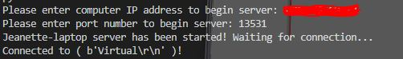
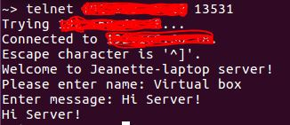

# Overview

This program creates a Server for which computers can connect to and chat to a single computer connected or to all the computers connected. This server is a client - server network using TCP.

# Development Environment

* Visual Studio Code 
* Python 3.8.5
* github
* git
* Multiple computers and or a Virtual Machine on your computer

# Execution

To execute the program you must have the command 'telnet' activated on your computer and the computers you would like to connect. You also must have your computer's IP address (for the server IP address) and a port that you would like to use. It is recommended to use a bigger number, such as 13531, for your port because the lower ports are occupied by other programs on your computer. Be sure to give this exact information to the other computers that need to connect. Then: `python server.py` or hit run in visual studio code or download the files from git and double click on `server.py`.

I have included the instructions for activating 'telnet' on windows computer down in the resources below. How to find your IP address on you computer will be included as well in the resources below.
These are the first two resources.

## Beginning and setup
The beginning of the project will ask the user for the computer IP address that the server will be running on and what port it will want to use.
If the correct input is put in the computer will welcome the user to the server and wait for a connection from another computer.

When it has connected to a computer, it will print the nickname of the computer that it is connected to. The computer gets the nickname from input from the connecting computer.

This is the veiw of the connecting computers. (This is from my Virtual Computer on my computer.)

## Chat Room

If there is only one computer connected to the server, the messages will be shared to the computer and the server. The server will not respond but the messages can be seen.

When there is more than one computer connected to the server, the server will ask the client which client it wants to send the message to or if it wants to send the message to all computers.

To leave the server, the computer can hit enter where the message is to be entered and it will display a Thank you message and delete the computer off the server.

If all computers have left, the server will end.

## Protection
The input for the IP address and for the Port are checked to be sure they have valid inputs when the server begins.

# Useful Websites and other Resources
* https://support.na.sage.com/selfservice/viewContent.do?externalId=11120&sliceId=1
* https://www.avast.com/c-how-to-find-ip-address#:~:text=Here's%20how%20to%20find%20your%20computer's%20local%20IP%20address%20in,and%20your%20IP%20address%20appears.
* https://www.privateinternetaccess.com/blog/tcp-vs-udp-understanding-the-difference/
* https://www.youtube.com/watch?v=DIPZoZheMTo
* https://www.youtube.com/watch?v=Lbfe3-v7yE0
* https://www.youtube.com/watch?v=FGdiSJakIS4&t=5s
* https://stackoverflow.com/questions/51961386/typeerror-string-argument-without-an-encoding
* https://en.wikipedia.org/wiki/Transmission_Control_Protocol
* https://www.howtogeek.com/190014/htg-explains-what-is-the-difference-between-tcp-and-udp/