# Overview

This program helps teachers take attendance in their classes. With an input of the class list, the program allows students to sign in and then the teacher can know who is here and who isn't and export that data into files to save for later.

# Development Environment

* Visual Studio Code 
* Python 3.8.5
* github
* git

# Execution

To execute the program have a class list of students in a txt file prepared. Then: `python Attendance.py` or hit run in visual studio code.

Here is an image of the CS246.txt file I used to test my code:

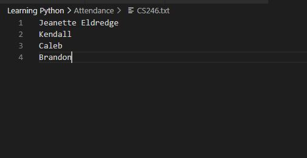

The last names were erased for privacy purposes.

## Beginning and setup
The project welcomes you and asks for the path to the file that contains the list of students in the class. Once the user gives it the file, it opens it and puts the contents of the file into a list and counts the number of students. This part is done by the teacher. 

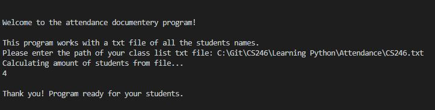

## Student part
As each student comes in, they will enter their first and last name into the computer. It welcomes them to class and asks if more students are arriving. If the student types Y, the loop will continue and more students can add their names. If the student types N, the loop will stop and the student part is done.

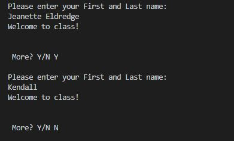

The code will be sure that the name they enter is on the list. If it isn't it will ask for them to reenter their name.

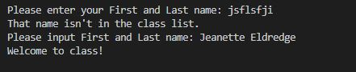

## Choice selection
After the students are done, the teacher has 6 options. They can choose to see who is here by typing 1. This will display the list created of who is in attendance of the class. 

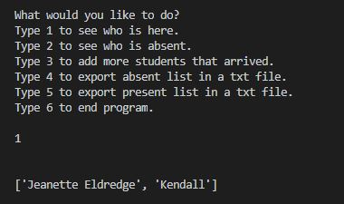

The Teacher can type 2 to display the opposite and see who is absent. 

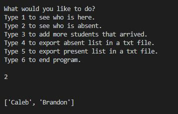

Typing 3 will allow the teacher to add more students who come in to the attendance list. It will remove the student from the absent list.

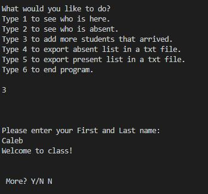

Typing 4 will export the data of those who are absent to a .txt file. The teacher can name the file and it will be stored in the same place as the python program.

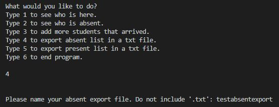

Here is the result for typing 4 with my test file. It created a file with the name I typed and placed it in the same folder I have my python code

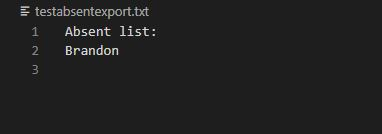

Typing 5 will export the data of those who are present to a .txt file. The teacher can name the file and it will be stored in the same place as the python program.

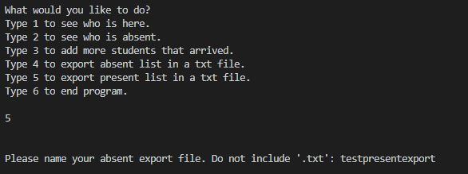

Here is the result for typing 5 with my test file. It created a file with the name I typed and placed it in the same folder I have my python code

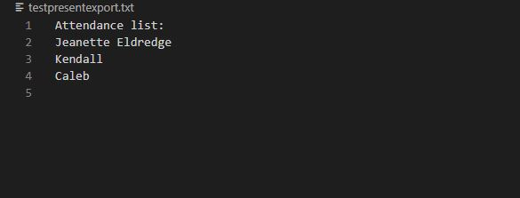

Typing 6 will stop the continous loop of choices and end the program

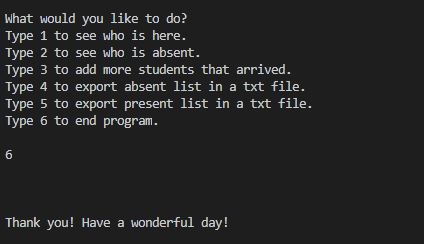

## Protection
Each input is protected with statements or loops to be sure that the correct input is put into the program

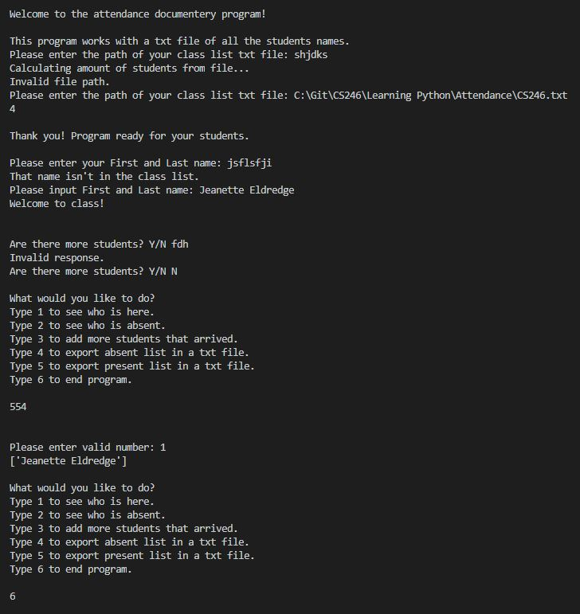

# Useful Websites and other Resources
* https://docs.python.org/3/tutorial/modules.html
* https://careerkarma.com/blog/python-check-if-file-exists/
* https://docs.python.org/3/tutorial/errors.html
* https://www.geeksforgeeks.org/create-an-empty-file-using-python/
* https://www.geeksforgeeks.org/python-return-statement/
* https://www.w3schools.com/python/python_functions.asp
* https://www.geeksforgeeks.org/reading-writing-text-files-python/
* https://runestone.academy/runestone/books/published/thinkcspy/SimplePythonData/StatementsandExpressions.html#:~:text=An%20expression%20is%20a%20combination,expression%20and%20displays%20the%20result.
* https://www.programiz.com/python-programming/methods/list/remove

