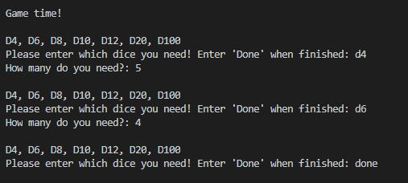
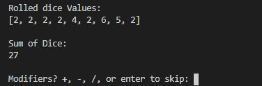
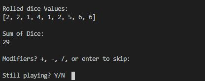
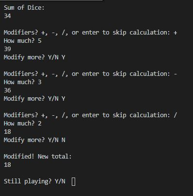
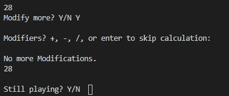
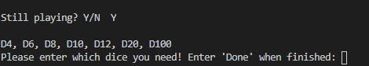
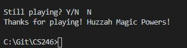

# Overview

This program is a D&D dice roller and modifier! 
It can handle several different types of dice at once and different amounts of each dice needed to roll. It will select the correct number of random numbers for each dice and put them in a list to display and then add them together.
It will then ask the user if modifiers are needed and modify it according to the user's input. 

# Development Environment

* Visual Studio Code 
* Python 3.8.5
* github
* git

# Execution

To execute the program: `python DiceRoller.py` or hit run in visual studio code.

## Beginning
The program will welcom you and ask you to enter a dice name. 
Then it asks how many of that dice do you need. 
The loop continues until you type 'done'.

## Calculations
 The program displays the values it rolled and adds them together. Then displays the sum. Next, it asks the user if they need to modify the roll.

## Modifying loop
 Modifying the roll gives the user 4 options. If at the beginning the roll doesn't need to be modified, hitting enter will skip the modifying loop and continue the program.
 

 If the roll does need to be modified, the user can modify it by adding, subtracting, or dividing.
 These situations are looped so that a user can do multiple calculations on one roll. 

 After selecting the operation, the program will ask for the number to complete the math equation and calculate the change. It will then display the new number and ask if the number needs to be modified more. 
 

 If the roll needs to be modified, a user can enter Y. If not, typing N will display the modified sum and continue the program.

 Hitting enter after calculating once will result in the display of the sum and break the loop.

 

## Game loop
After the display of the sum, the program asks if the user is still playing.
If so, typing Y will restart the loop.

Typing N will result in the end of the program and it will exit.

## Protection
Each input is protected with exception statements or while statements to be sure that the correct input is put into the program

# Useful Websites and other Resources
* https://www.pythonforbeginners.com/basics/break-and-continue-statements
* https://stackoverflow.com/questions/23294658/asking-the-user-for-input-until-they-give-a-valid-response
* https://stackoverflow.com/questions/19782075/how-to-stop-terminate-a-python-script-from-running/34029481#:~:text=To%20stop%20a%20running%20program,want%20to%20terminate%20the%20program.&text=Ctrl%20%2B%20Z%20should%20do%20it,caught%20in%20the%20python%20shell.
* https://careerkarma.com/blog/python-uppercase/#:~:text=The%20Python%20upper()%20method,false%20if%20they%20aren't.
*https://www.dotnetperls.com/string-list-python
* https://www.kite.com/python/answers/how-to-make-a-while-loop-with-multiple-conditions-in-python#:~:text=Use%20or%20and%20and%20to%20make%20a%20while%20loop%20with%20multiple%20conditions&text=Use%20or%20to%20require%20that,a%20while%20loop%20to%20execute.
* https://snakify.org/en/lessons/print_input_numbers/
* https://www.stechies.com/typeerror-list-indices-must-be-integers-or-slices-not-str/#:~:text=These%20indexes%20are%20always%20defined,or%20slices%2C%20not%20str%E2%80%9D.
* https://careerkarma.com/blog/python-typeerror-list-indices-must-be-integers-or-slices-not-str/
* https://www.w3schools.com/python/python_ref_list.asp
* https://www.w3schools.com/python/python_lists.asp
* https://www.dieharddice.com/pages/d-d-dice-explained#:~:text=What%20are%20DnD%20Dice%3F&text=To%20start%20playing%2C%20you%20only,is%20used%20for%20percentile%20rolls.
* https://www.openbookproject.net/books/bpp4awd/ch03.html
* https://www.geeksforgeeks.org/python-tuple-function/
* https://www.programiz.com/python-programming/tuple
* https://realpython.com/python-dicts/
* https://docs.python.org/3/tutorial/errors.html
* Kussmaul, Cliff, et al. Beginner's Step-by-Step Coding Course: Learn Computer Programming the Easy Way. DK Publishing, 2020. 

