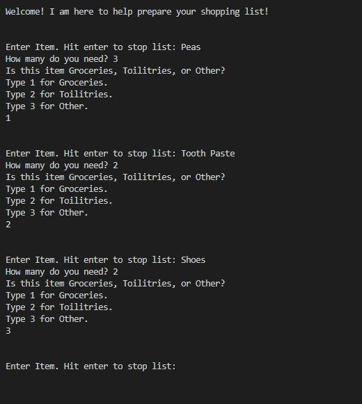
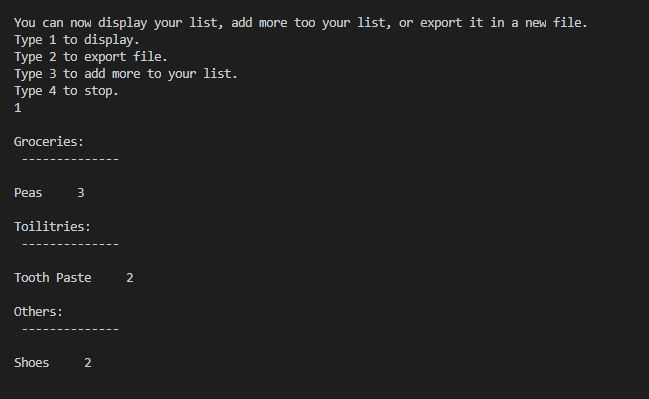
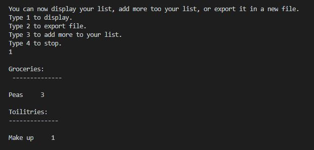
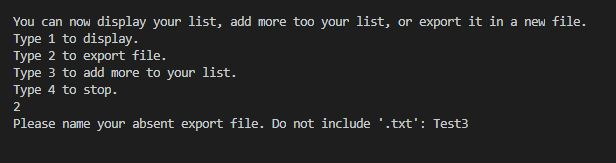
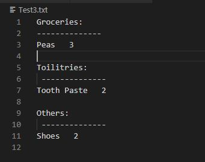
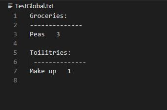
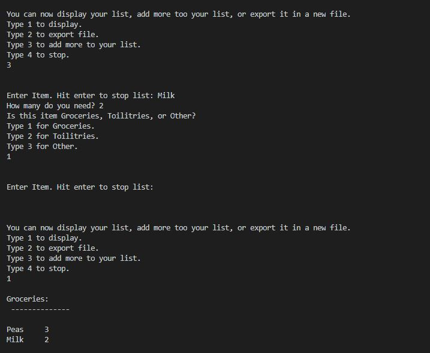
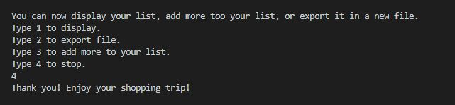
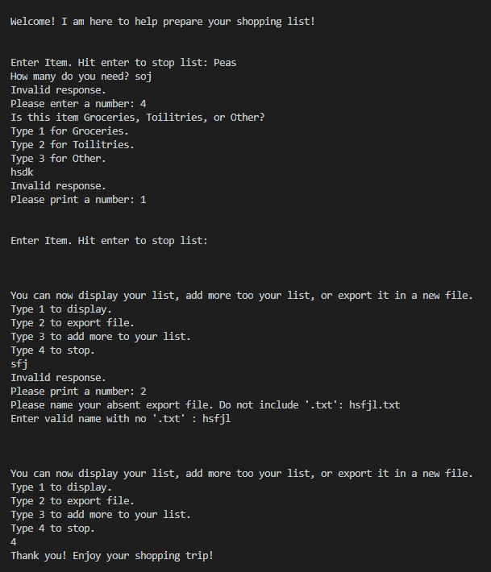

# Overview

This program helps the user create an organized shopping list with a new class called Items. After the list is created, a user can display, add more, or export it.

# Development Environment

* Visual Studio Code 
* Python 3.8.5
* github
* git

# Execution

To execute the program: `python MainCode.py` or hit run in visual studio code.

## Beginning
The project welcomes you and then calls the makinglist() function that starts a loop. The loop asks for the item name, how many you need, and then a number to select what catagory the item is in. Typing 1 will signify that the item is something that needs to be frozen or refrigerated. Typing 2 will tell the program that the item belongs in the toiletries catagory. Typing 3 will signify that the item is in a different catagory not listed.
Hitting Enter when it asks for a name of an item will break the loop and begin the next part of the program.

## Choice selection
After the list is created and the loop is broken, a new loop is started. This loop asks the user what it wants to do with the new list created. The user will have 4 choices.

The first choice will display the list that has been created. To choose this option the user will type 1.

If a catagory wasn't used, then it will not be displayed.

The user can type 2 to export the list into a printable text file. The program will ask for the name of the file that they want and then create a .txt file in the same place as the code is.

Here is a picture of the exported file when the program was tested.

If a catagory wasn't used, then it will not be displayed.

Typing 3 will allow the user to add more to their list. The user then can press 1 to display the list they could see that the added item was in the list. They could also export the list again.

Typing 4 will stop the continous loop of choices and end the program.

## Protection
Each value input is protected with statements or loops to be sure that the correct input is put into the program. 

# Useful Websites and other Resources
* https://docs.python.org/3/tutorial/classes.html
* https://www.w3schools.com/python/python_classes.asp
* https://www.w3schools.com/python/python_inheritance.asp
* https://www.daniweb.com/programming/software-development/code/216631/a-list-of-class-objects-python
* https://www.w3schools.com/python/gloss_python_global_variables.asp
