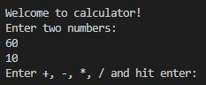
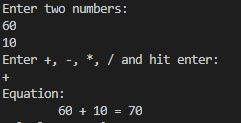
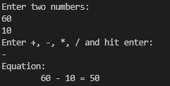
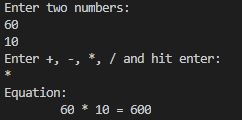
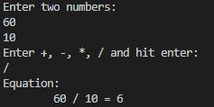
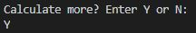
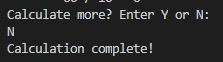
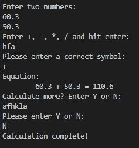

# Overview

This program is a simple calculator that can handle two number equations. It supports adding, subtracting, 

# Development Environment

* Visual Studio Code 
* Java 11
* github
* git

# Execution

To execute the code hit run in visual studio code or on your JAVA coding software.

## Beginning and setup
The beginning welcomes the user to the calculator program and then it begins the loop code that asks for 2 numbers and a symbol.

## Number input
The prompt accepts any type of number because it is stored as a float in the program. This means that the numbers could be real numbers and decimals.
The program handles the display of the numbers according to their remainders. For example, If 10.0 is inputed the computer will write it as 10. This is shown in the displays of the equation.

## Choice selection
After entering the numbers in the prompt, the next prompt asks for a symbol that represents the type of math the computer needs to do. The symbols are +, -, *, and /. 

Symbol + :

Symbol - :

Symbol * :

Symbol / :

## Continuing the loop

After completing one prompt, the program will ask if the user would like to continue calculating. The user can type Y or N.

Typing Y will continue the program and redisplay the prompt.

Typing N will end the program.

## Protection
The number, symbol, and the loop input choices are protected to be sure that the correct input is put in.

# Useful Websites and other Resources
* https://www.w3schools.com/java/java_classes.asp
* https://www.java67.com/2015/10/how-to-convert-float-to-int-in-java-example.html
* https://dojo.domo.com/t5/Workbench/What-the-difference-between-double-and-long-data-types/td-p/15852#
* https://stackoverflow.com/questions/30249324/how-to-get-java-to-wait-for-user-input/30249614
* http://pages.cs.wisc.edu/~hasti/cs368/JavaTutorial/NOTES/JavaIO_Scanner.html
* 