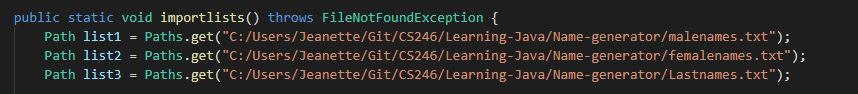
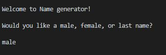
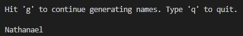
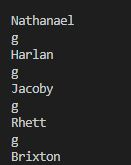
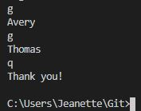
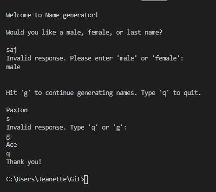

# Overview

This program is a name generator which takes the input of 3 lists in .txt files and then randomly selects one out of the category of the user's choosing: Male, Female, or Last Name.

# Development Environment

* Visual Studio Code 
* Java
* github
* git

# Execution

To execute the program, you must download the included lists of names and replace the paths in the code for the path to where you downloaded the file. This can be found in the "importFiles" function in the NameGenerator code. 

 Be sure when adding your paths that all `\` or `\\` are switched to /. If this isn't done, Java will not understand the path you gave it and will through errors.

Then hit run in visual studio code.

## Beginning and setup
The project welcomes the user and asks whether they would like a male name, female name, or a last name. User will type in their answer and hit enter.

## Background work
After hitting enter, the program will display instructions. Then the program proceeds to import the 3 files with names into ArrayLists. 

These files are: femalenames.txt, malenames.txt, and Lastnames.txt. They are included in this repository.

ArrayLists allow the program to access the names better and are an important part of how the random generator works. The program will use the Random class to generate a random number. It grabs that name at that number in the list and displays it as the first name generated.

## Choice selection
After the first name is generated, a user can type either 'g' or 'q'. 

Typing 'g' will continue generating names with the previous specifications as the first name.

Typing 'q' will thank the user and end the program.

## Protection
Each input is protected with while loops to be sure that the correct input is put into the program. Exception errors are thrown if the file can't be read or found.

# Useful Websites and other Resources
* https://www.w3schools.com/java/java_arraylist.asp
* https://stackoverflow.com/questions/5343689/java-reading-a-file-into-an-arraylist
* https://stackoverflow.com/questions/19844649/java-read-file-and-store-text-in-an-array
* https://examples.javacodegeeks.com/java-not-equal-example/#:~:text=It%20is%20symbolized%20%22!%3D,value(true%20or%20false).
* https://stackoverflow.com/questions/1795808/and-and-or-in-if-statements
* https://www.w3schools.com/java/ref_string_tolowercase.asp
* https://www.w3schools.com/java/java_user_input.asp
* https://byui-cse.github.io/cse310-course/lesson06/06-teach.html
* https://code.visualstudio.com/docs/java/java-tutorial
* https://stackoverflow.com/questions/4646577/global-variables-in-java
* https://www.w3resource.com/java-tutorial/arraylist/arraylist_get.php
* https://www.educative.io/edpresso/how-to-generate-random-numbers-in-java
* https://www.geeksforgeeks.org/path-tostring-method-in-java-with-examples/
* https://docs.oracle.com/javase/8/docs/api/java/nio/file/Paths.html
* https://www.codota.com/code/java/methods/java.nio.file.Paths/get
* https://stackoverflow.com/questions/7209110/java-util-nosuchelementexception-no-line-found
* https://devblogs.microsoft.com/java/java-on-visual-studio-code-update-march-2020/
* https://code.visualstudio.com/docs/languages/java
* https://docs.oracle.com/javase/7/docs/api/java/util/Scanner.html
* https://github.com/Microsoft/vscode-java-debug/blob/master/Troubleshooting.md#build-failed-do-you-want-to-continue