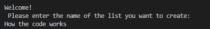
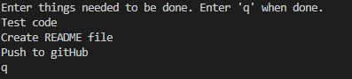
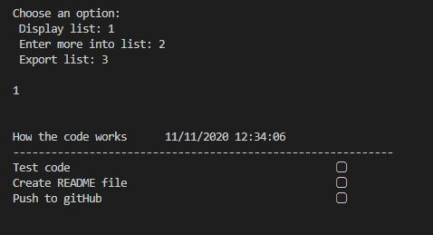
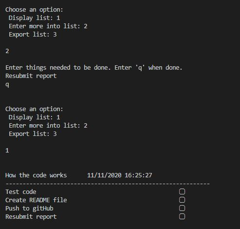
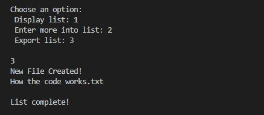
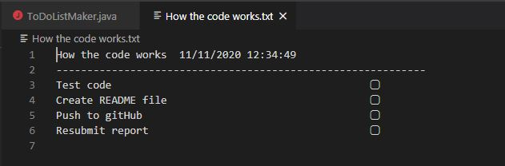
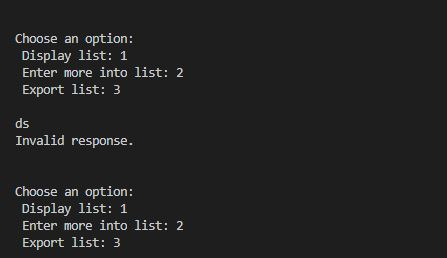
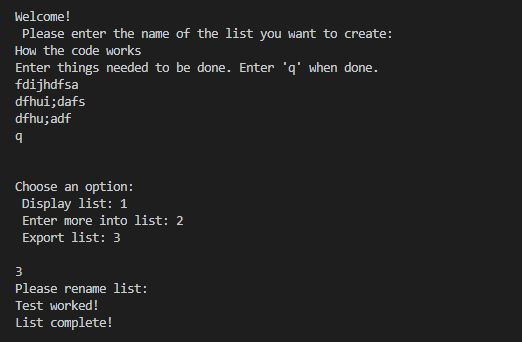
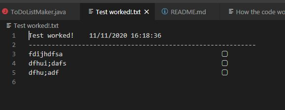

# Overview

This program is a Todo list maker. User can name and create a list and display it or export it to print it out. 

# Development Environment

* Visual Studio Code 
* Java 11
* github
* git

# Execution

To execute the code hit run in visual studio code or on your JAVA coding software.

## Beginning
The beginning welcomes the user to the calculator program and then asks the user to name the list they are going to make. For this example, I named the list "How the code works"

## List input
The list input is a continual loop that starts right after the name of the list is inputed. The user can input as many things in the list as they want and then typing q will end the loop and continue to the next options.

## Choice selection
After typing q the program will display 3 options. The user can type 1, 2, or 3 to select which option they would like to do.

Typing 1 will display the list created.

Typing 2 will allow the user to continue adding more to the list. In the example, I added "Resubmit report" and then displayed the list again to show that it did add it to the list.

Typing 3 will create a new file with the same name as the list and write the list to that file so it can be printed out. The program notifies the user that a new file has been created and tells the name of the file before closing the program

This is a display of the file I created to demonstrate the code.

## Protection
The option choice is protected so that only 1, 2, or 3 can be entered.

There is also protection on writing the file. If the file name exists already, the program will ask you to rename the file before creating it.
I tried to over write the "How the code works.txt" file. 
The program stopped me and had me rename the file. "Test worked!" Then it exported the file.

# Useful Websites and other Resources
* https://stackoverflow.com/questions/3844307/how-to-read-file-from-relative-path-in-java-project-java-io-file-cannot-find-th/43271117
* https://howtodoinjava.com/java/io/java-write-to-file/
* https://stackoverflow.com/questions/19393202/how-can-i-add-a-space-in-between-two-outputs
* https://www.educative.io/edpresso/how-to-find-the-length-of-a-string-in-java#:~:text=The%20length()%20method,member%20method%20of%20this%20class.
* https://www.javatpoint.com/java-get-current-date
* https://www.w3schools.com/java/java_files_create.asp
* https://www.baeldung.com/java-printstream-printf
* https://stackoverflow.com/questions/15961130/align-printf-output-in-java