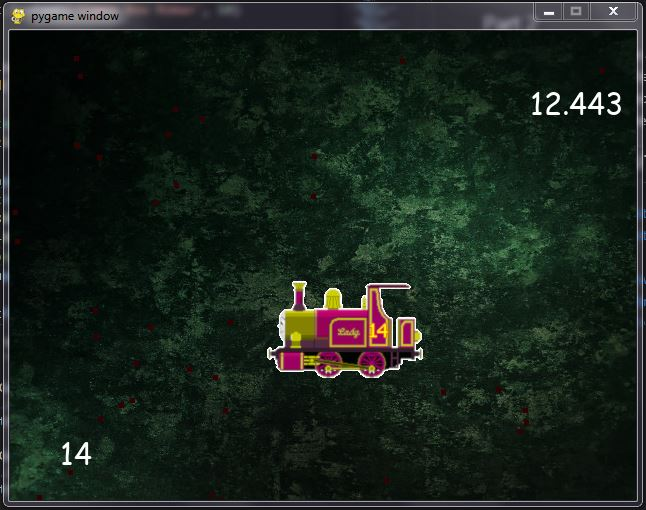
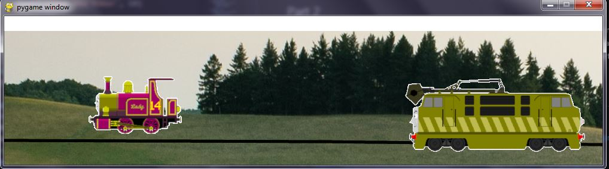

# Overview

This program is a pygame design, based on the movie "Thomas and the Magic Railroad." The goal of the game is collect enough coal to beat the evil Diesel 10 in a chase to the Viaduct.

# Development Environment

* Visual Studio Code 
* Python 3.8.5
* pygame library
* github
* git

# Execution

To execute the program, be sure that you have pygame library downloaded on your computer then hit run in visual studio code.

## Part 1
Part one of the game is collecting pieces of coal. Use the left, right, up, and down arrow keys to move Lady and collect the 50 pieces of coal with in 15 seconds. A timer is displayed at the top right corner of the screen. The amount of coal collected is displayed at the bottom left corner of the screen.

## Part 2
Part 2 of the game will be a chase scene between Diesel 10 and Lady. If the player can make it to the viaduct before Diesel 10 catches up to them. The player can press the space bar to give Lady a boost of speed or press the letter t to send Diesel 10 back 6 pixels. 
This part of the game is not yet finished.

# Useful Websites and other Resources
* https://code.visualstudio.com/docs/editor/integrated-terminal
* https://www.deviantart.com/jamesfan1991/art/Thomas-the-Tank-Engine-Full-Sprite-Sheet-518202568
* https://stackoverflow.com/questions/17240442/how-to-make-the-background-continuously-scrolling-with-pygame
* https://stackoverflow.com/questions/37506758/how-to-make-a-pygame-sprite-group-move
* https://www.pygame.org/docs/ref/surface.html#pygame.Surface.scroll
* https://www.pygame.org/docs/ref/surface.html#pygame.Surface.scroll
* https://stackoverflow.com/questions/44610428/how-to-use-pygame-surface-scroll
* https://unsplash.com/photos/-SO3JtE3gZo
* https://www.pygame.org/docs/ref/sprite.html

